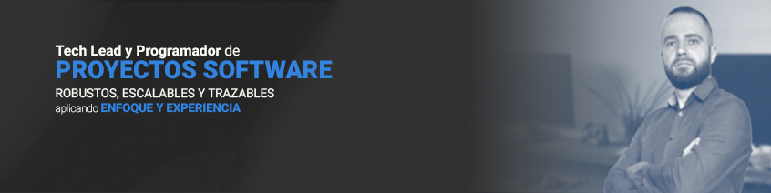
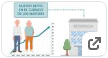

<strong>Desarrollador y líder tecnológico</strong> con experiencia en soluciones software para escritorio, web y entornos industriales. Apasionado por la innovación y la resolución de problemas, me caracterizo por mi capacidad de adaptación, aprendizaje continuo y toma de decisiones estratégicas. He liderado equipos y proyectos, siempre con un <strong>enfoque práctico y orientado a resultados</strong>.

Siempre dispuesto a <strong>afrontar nuevos desafíos</strong> y seguir <strong>creciendo profesionalmente</strong>.

 
 

<h1>Último proyecto desarrollado</h1>
<section>
  
  
Debian Linux | NGINX | PHP | MariaDB | Python | HTML 5 | JS

   
  
Actualmente estoy desarrollando un sistema basado en <strong>deep learning</strong> capaz de obtener el <strong>distintivo ambiental</strong> de un vehículo (CERO, ECO, C, B) a partir de una fotografía de su matrícula.

  
El objetivo es demostrar cómo combinar <strong>Computer Vision, OCR y procesamiento eficiente</strong> de datos para resolver un problema real con múltiples retos técnicos: detección precisa, OCR robusto, alto rendimiento y validación con fuentes externas.

  <a href="https://github.com/yosusanz/distintivoAmbiental" target="_blank">
  
Enlace al proyecto

  </a>
</section>

 
<h1>Proyecto destacado</h1>
<section>
  <h2>Plataforma de <strong>monitorización y detección de caídas</strong> no intrusiva</h2>

  
<strong>Rol:</strong> Tech Lead & Arquitecto de Solución 
     <strong>Periodo:</strong> 2022–2025 
     <strong>Sector:</strong> Salud – residencias, hospitales y hogares 
     <strong>Stack:</strong> 
      

         
         
         
         
         
         
             
      

      
Debian Linux | NGINX | PHP | MariaDB | .NET Core | HTML 5 | JS

  

  <h3>🧩 Descripción general</h3>
  

    <strong>Diseñé y lideré</strong> el desarrollo de una solución innovadora para la <strong>monitorización no intrusiva, de personas en entornos asistenciales y domésticos</strong>,
    capaz de detectar caídas, signos vitales, posición y patrones de movimiento <strong>sin necesidad de dispositivos físicos sobre el cuerpo, ataduras, ni cámaras en la estancia</strong>.
  

  <ul>
    <li><strong>Dispositivos inteligentes</strong> conectados que analizaban datos biométricos y de movimiento.</li>
    <li><strong>Backend distribuido</strong> para el procesamiento de eventos y generación de alertas.</li>
    <li><strong>Interfaces web y móviles</strong> adaptadas a distintos perfiles (usuarios, profesionales).</li>
    <li>Integración con sistemas de terceros a través de <strong>APIs</strong>.</li>
  </ul>

  <h3>🔧 Responsabilidades y logros</h3>
  <ul>
    <li>Definición de <strong>arquitectura y stack</strong> tecnológico desde cero.</li>
    <li><strong>Formación y liderazgo</strong> de un equipo de desarrollo multidisciplinar.</li>
    <li>Implementación de un <strong>sistema modular, escalable y eficiente</strong>.</li>
    <li>Desarrollo de <strong>herramientas de visualización en tiempo real</strong> para uso comercial y técnico.</li>
    <li>Creación de mecanismos de <strong>protección anticopia y control de despliegues</strong>.</li>
    <li>Desarrollo del <strong>sistema productivo, trazable</strong> y bajando tiempos de 6 horas a 1 minuto por dispositivo fabricado y listo para usar.</li>
  </ul>

  <h3>📈 Resultados</h3>
  <ul>
    <li>La segunda versión del sistema logró resultados muy superiores respecto a la inicial, con <strong>funcionamiento estable en entornos reales</strong>.</li>
    <li><strong>Demostraciones exitosas</strong> ante empresas interesadas en distribución y expansión internacional.</li>
    <li>Reconocimiento interno por la <strong>solidez técnica del producto</strong> y la mejora en eficiencia operativa.</li>
  </ul>

  <h3>🔗 Recursos públicos relacionados</h3>
  
  

</section>

 
<h1>Tecnología y stack</h1>
<section>
  
Mi enfoque combina experiencia en desarrollo fullstack, diseño de <strong>arquitecturas robustas, escalables y siempre con el foco en el futuro</strong> de los proyectos.

  <h3>💻 Backend</h3>
  <ul>
    <li>.NET Framework / .NET Core (VB.NET)</li>
    <li>PHP (sin frameworks, arquitectura limpia)</li>
    <li>APIs REST, tareas en background, control de procesos</li>
  </ul>

  <h3>🖥️ Frontend</h3>
  <ul>
    <li>HTML, CSS, JavaScript</li>
    <li>Diseño funcional y enfoque minimalista</li>
  </ul>

  <h3>🗄️ Bases de datos</h3>
  <ul>
    <li>MariaDB / MySQL, SQL Server</li>
    <li><strong>Optimización de rendimiento</strong>: técnicas de segmentación, índices, tablas en memoria</li>
  </ul>

  <h3>🐧 Infraestructura y DevOps</h3>
  <ul>
    <li>Linux Debian – scripting y administración de sistemas</li>
    <li>Docker – contenedores para backend y despliegues rápidos</li>
    <li>NGINX, Apache – balanceo y servidores web</li>
  </ul>

  <h3>📦 Otros</h3>
  <ul>
    <li>GitHub – versionado, ramas limpias y control de cambios</li>
    <li>Diseño e ingeniería inversa de sistemas heredados</li>
    <li>Protecciones anticopia, demos, herramientas de análisis y trazabilidad</li>
  </ul>

  <h3>🧠 Adaptabilidad tecnológica</h3>
  

    Aunque cuento con un stack base muy consolidado, me resulta natural <strong>aprender nuevas tecnologías</strong>, <strong>adaptarme</strong> a entornos existentes
    o <strong>evolucionar</strong> arquitecturas heredadas. En cada proyecto, pongo el foco en <strong>entender el contexto técnico y funcional</strong> para construir soluciones sostenibles y con visión a largo plazo.
  

</section>

 
<h1>Contacto</h1>
<section>
  
Abierto a <strong>crear conexiones profesionales</strong>, compartir experiencias y conversar sobre tecnología, arquitectura de software y liderazgo técnico.
 

  <ul>
    <li><strong>Email:</strong> <a href="mailto:yosu@yosusanz.com">yosu@yosusanz.com</a></li>
    <li><strong>LinkedIn:</strong> <a href="https://www.linkedin.com/in/yosusanz/" target="_blank">linkedin.com/in/yosusanz</a></li>
  </ul>

  
Si crees que podemos coincidir profesionalmente, estaré encantado de mantener el contacto.

   
  <h3 align="center">La diferencia entre el silencio y una conversación comienza por un "hola". <strong>¿Hablamos?</strong></h3>
</section>
